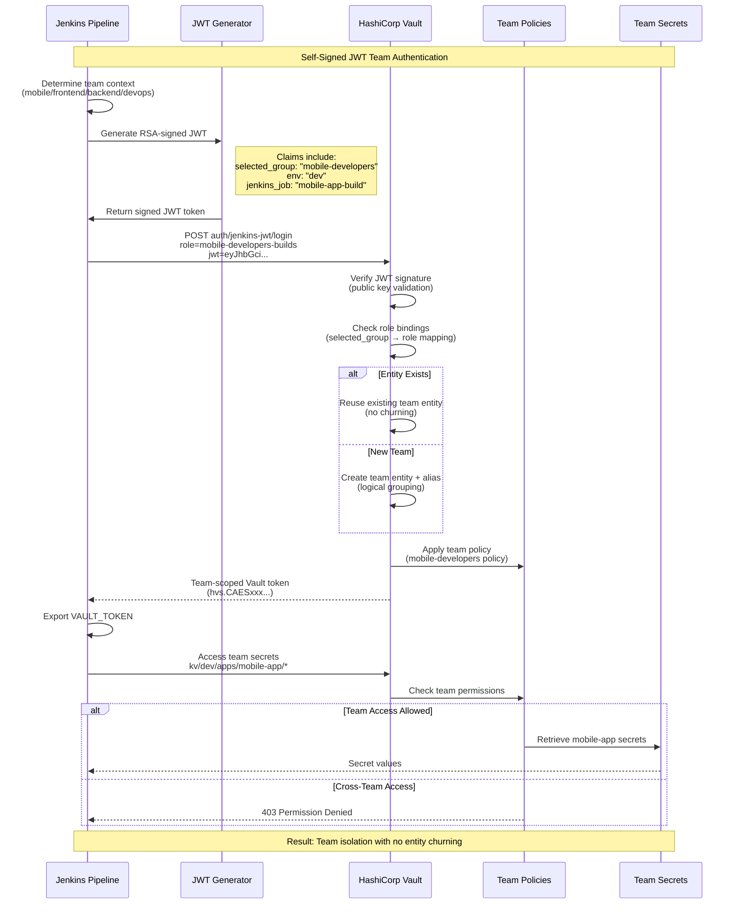

# Jenkins ↔ Vault JWT Authentication POC (with Okta Integration)

A comprehensive simulation demonstrating **team-based JWT authentication** between Jenkins and HashiCorp Vault with **logical workload grouping** and **Okta SSO integration**.

## Quick Start (One Command!)

**Complete zero-to-running setup:**
```bash
./scripts/start.sh
```

This single command:
- Creates vault.hcl configuration automatically
- Starts Docker containers (Jenkins + Vault)
- Auto-bootstraps fresh Vault if needed (generates keys)
- Auto-unseals Vault with generated keys
- Synchronizes tokens between vault-keys.txt and .env
- Ready for team authentication and secret access

**Complete setup and testing:**
```bash
# 1. Start everything (auto-bootstrap if fresh)
./scripts/start.sh

# 2. Configure JWT authentication + team policies  
./scripts/setup_vault.sh

# 3. Populate team-specific test secrets
./scripts/seed_secret.sh

# 4. Test JWT authentication (example: mobile team)
JWT_TOKEN=$(./scripts/sign_jwt.sh mobile-developers)
source .env  # Load VAULT_ADDR
vault write auth/jenkins-jwt/login role=mobile-developers-builds jwt="${JWT_TOKEN}"
# Copy the returned token and set: export VAULT_TOKEN="hvs.CAESxxx..."
vault kv get kv/dev/apps/mobile-app/example  # Should work
vault kv get kv/dev/apps/backend-service/example  # Should fail (403)
```

**Results**: Complete team-based JWT authentication with verified secret isolation in under 2 minutes!

### JWT Authentication Flow

**Jenkins-Vault Team-Based Authentication:**



**For detailed JWT claims, policies, and implementation → See [ROLE_BASED_AUTH.md](ROLE_BASED_AUTH.md)**

---

## What This POC Proves

- **Zero Entity Churning**: Same entity/alias reused across team member logins  
- **Logical Grouping**: Entity count scales with teams, organizing identical workloads efficiently  
- **Comprehensive Setup**: Raft storage, proper policies, automation, persistence  
- **Secure**: Job-scoped access with dynamic policy templating  
- **Scalable**: Supports large monorepos with multiple development teams  

**Verified**: Real JWT authentication tested with entity ID tracking - **no churning detected**.

## Key Features

- **JWT Authentication**: Jenkins → Vault using self-signed JWTs
- **Team-Based Access**: One entity per team groups identical workloads logically
- **No Entity Churning**: Proven entity/alias reuse within teams
- **Job-Scoped Secrets**: Dynamic policy templating based on pipeline context
- **Persistent Data**: Survives container restarts with auto-unseal
- **Comprehensive Setup**: Raft storage, proper policies, automation scripts

## Architecture Overview

### Team-Based Entity Model
```
Mobile Team         →  Entity: mobile-developers      →  Secrets: kv/dev/apps/mobile-app/*
Frontend Team       →  Entity: frontend-developers    →  Secrets: kv/dev/apps/frontend-app/*
Backend Team        →  Entity: backend-developers     →  Secrets: kv/dev/apps/backend-service/*
DevOps Team         →  Entity: devops-team            →  Secrets: kv/dev/apps/devops-tools/*
```

**Benefits:**
- **No Churning**: Same entity reused by all team members
- **Logical Organization**: Entity count = number of teams (groups identical workloads)
- **Secure**: Job-scoped access via policy templating
- **Scalable**: Supports large organizations with multiple teams

## Comparison with Other Approaches

| Approach | Entities Created | Workload Organization | Team Isolation | Complexity |
|----------|------------------|------------------|----------------|------------|
| **Per Developer** | 1 per developer | High | Excellent | Medium |
| **Single Shared** | 1 total | Minimal | None | Low |
| **Per Team (This POC)** | 1 per team | Low | Good | Medium |

### Why Team-Based is Optimal:
- **Logical Grouping**: Groups identical workloads by team function
- **Security**: Natural isolation boundaries align with org structure  
- **Scalability**: Linear growth with workload types rather than individual users
- **Management**: Easier to audit and manage team-based access

## Quick Start

### One-Command Setup (From Zero to Running!)
```bash
./scripts/start.sh
```
**This single command handles everything automatically:**
- Creates Vault configuration (`vault.hcl`) if missing
- Starts Docker containers (Jenkins + Vault)
- Auto-bootstraps Vault if uninitialized (generates `vault-keys.txt`)
- Auto-unseals Vault with generated keys
- Updates `.env` file with current tokens
- Shows status and access URLs

**Perfect for:** Fresh clones, clean environments, complete rebuilds

### Setup Team Authentication & Secrets
```bash
# Configure JWT auth, policies, and team roles
./scripts/setup_vault.sh

# Populate team-specific test secrets
./scripts/seed_secret.sh
```

### Stop Everything  
```bash
./scripts/stop.sh
```
Data is preserved in `./data/` directory.

### Test JWT Authentication
```bash
# Create JWT for any team and test authentication
./scripts/sign_jwt.sh mobile-developers
./scripts/sign_jwt.sh backend-developers
./scripts/sign_jwt.sh frontend-developers
./scripts/sign_jwt.sh devops-team
```

## Access URLs
- **Jenkins**: http://localhost:8080
- **Vault UI**: http://localhost:8200 
- **Root Token**: `<found in vault-keys.txt>` (stored in `vault-keys.txt`)

## Data Persistence
- **Jenkins**: `./data/jenkins_home/` (preserves all Jenkins config)
- **Vault**: `./data/vault/data/` (Raft storage, preserves secrets)
- **Keys**: `./vault-keys.txt` (WARNING: Keep secure - contains unseal keys!)

## Vault Configuration
- **Auth Method**: JWT (`jenkins-jwt/`)
- **Policy**: One per team:
    - `mobile-developers.hcl`
    - `frontend-developers.hcl`
    - `backend-developers.hcl`
    - `devops-team.hcl`
- **Role**: One per team (e.g., `mobile-developers`, `frontend-developers`, `backend-developers`, `devops-team`) for Jenkins pipelines
- **Entity**: One per team (e.g., `mobile-developers`, `frontend-developers`, `backend-developers`, `devops-team`)
- **JWT Claims**: `selected_group` field set to team name (e.g., `selected_group: "mobile-developers"`)
- **Secrets**: Seeded test data in team-specific paths (e.g., `kv/dev/apps/mobile-pipeline/*`)

## Verification & Testing

### Verify No Entity Churning
```bash
# Run comprehensive verification test
./verification/verify-no-churn.sh

# Show team-based entity management concepts
./verification/demo-team-entities.sh

# Complete team access demonstration
./verification/comprehensive-team-demo.sh
```

The verification scripts:
1. Record current entity/alias state
2. Perform real JWT authentication with team-based claims
3. Verify same entity/alias IDs are reused within teams
4. **Prove no churning occurs within team contexts**

### Test Pipeline Integration
1. Access Jenkins: http://localhost:8080
2. Run `sample-pipeline` job
3. Watch JWT → Vault authentication in action
4. Verify secret access in job logs

## Configuration Details

### Team → Secret Mapping
```
Mobile Team      → kv/dev/apps/mobile-app/*      → iOS/Android builds, app credentials
Frontend Team    → kv/dev/apps/frontend-app/*    → Web builds, CDN, static assets  
Backend Team     → kv/dev/apps/backend-service/* → Databases, APIs, services
DevOps Team      → kv/dev/apps/devops-tools/*    → Infrastructure, monitoring, CI/CD
```

### JWT Authentication Flow
```
1. Jenkins generates JWT with team claim (selected_group)
2. JWT → Vault authentication → Team-scoped token
3. Team token → Access team secrets (other teams blocked with 403)
```

**For detailed JWT claims, policies, and implementation → See [ROLE_BASED_AUTH.md](ROLE_BASED_AUTH.md)**

---

## Okta Integration

This POC includes comprehensive **Okta SSO integration** for realistic team-based authentication scenarios:

### Integration Documentation
- **[Okta-Vault Integration Guide](okta/okta-vault-integration.md)** - Complete setup for Vault ↔ Okta integration
- **[Okta SSO Configuration Notes](okta/okta_sso_notes.md)** - SSO setup and configuration details

### Production Flow
```
Okta Groups → JWT Claims → Vault Roles → Team-Based Policies
     ↓              ↓            ↓               ↓
mobile-team → selected_group → mobile-developers → Mobile secrets
frontend-team → selected_group → frontend-developers → Frontend secrets  
backend-team → selected_group → backend-developers → Backend secrets
devops-team → selected_group → devops-team → DevOps + Shared secrets
```

### Key Benefits
- **Single Sign-On**: Users authenticate once via Okta
- **Group Mapping**: Okta groups automatically map to Vault teams
- **No User Management**: Team membership managed in Okta, not Vault
- **Scalable**: Add teams by creating Okta groups + Vault policies

---

## Testing & Verification

### End-to-End Authentication Test

**Quick verification that the system works:**

```bash
# 1. Load environment and generate JWT
source .env
JWT_TOKEN=$(./scripts/sign_jwt.sh mobile-developers)

# 2. Authenticate to get team token  
vault write auth/jenkins-jwt/login role=mobile-developers-builds jwt="${JWT_TOKEN}"

# 3. Use team token to access secrets
export VAULT_TOKEN="hvs.CAESxxxxx..."  # From step 2
vault kv get kv/dev/apps/mobile-app/example    # Works
vault kv get kv/dev/apps/backend-service/example  # 403 (isolated)
```

**For complete testing procedures → See [ROLE_BASED_AUTH.md](ROLE_BASED_AUTH.md)**

### Comprehensive Verification Scripts

```bash
# Run comprehensive verification test
./verification/verify-no-churn.sh

# Show team-based entity management concepts
./verification/demo-team-entities.sh

# Complete team access demonstration  
./verification/comprehensive-team-demo.sh
```

**These scripts verify:**
1. **No Entity Churning**: Same entity/alias reused within teams
2. **Team Isolation**: Teams cannot access other team secrets
3. **JWT Authentication**: Complete authentication flow works
4. **Policy Enforcement**: Vault policies properly restrict access

---

## Jenkins Configuration & Integration

### Jenkins Bootstrap (Fresh Installs Only)

**WARNING**: Only run on fresh Jenkins instances! This will overwrite existing configuration.

```bash
./scripts/bootstrap-jenkins.sh
```

**This script configures:**
- **Emergency Admin User**: Local admin for fallback access
- **Team-Based Permissions**: Global matrix authorization matching CASC
- **Group Permissions**: All teams get proper build/read/workspace access
- **Security Settings**: CSRF protection, setup wizard disabled

### Production Jenkins Integration

**For production Jenkins with existing OIDC/JWT configuration:**

1. **Manual Setup Required**: Don't run bootstrap script on configured instances
2. **Use CASC Configuration**: Deploy via `casc/jenkins.yaml`
3. **Vault Plugin Setup**: Install HashiCorp Vault plugin
4. **JWT Verification**: Configure JWT verification with public key from `keys/jenkins-oidc.pub`

### Team Permission Structure

The system configures these permissions for each team:

| Team | Permissions |
|------|-------------|
| **mobile-developers** | Read, Build, Cancel, Discover, Workspace, Replay, View |
| **frontend-developers** | Read, Build, Cancel, Discover, Workspace, Replay, View |
| **backend-developers** | Read, Build, Cancel, Discover, Workspace, Replay, View | 
| **devops-team** | Read, Build, Cancel, Discover, Workspace, Replay, View |

**Admin Users**: Full `Hudson.ADMINISTER` permissions

---

## Manual Setup (for reference)

> **Recommended:** Use `./scripts/start.sh` for automatic setup instead!

### 1) Start Containers
```bash
docker compose up -d
```

### 2) Bootstrap Vault (automated)
```bash
# Creates vault-keys.txt, initializes & unseals Vault, updates .env
./scripts/bootstrap-vault.sh
```

### 3) Configure Vault Authentication & Policies  
```bash
# Sets up JWT auth, team roles, and policies
./scripts/setup_vault.sh

# Populates team-specific test secrets
./scripts/seed_secret.sh
```

### 4) Manual Vault Operations (if needed)
```bash
# Manual initialization (only if bootstrap script not used)
docker exec vault vault operator init

# Manual unseal (only if needed)
./scripts/unseal-vault.sh
```

### 4) Get Jenkins Admin Password
```bash
docker logs jenkins | grep -A 10 "Please use the following password"
```

## Troubleshooting

### Vault Shows "Sealed" After Restart
This is normal! Vault seals itself on restart for security.
```bash
./scripts/unseal-vault.sh
```

### JWT Authentication Failures
```bash
# Check JWT role configuration for teams
export VAULT_ADDR="http://localhost:8200"
export VAULT_TOKEN="<your-root-token-from-vault-keys.txt>"

# Check team roles
vault read auth/jenkins-jwt/role/mobile-developers
vault read auth/jenkins-jwt/role/frontend-developers
vault read auth/jenkins-jwt/role/backend-developers
vault read auth/jenkins-jwt/role/devops-team

# Verify bound claims are set correctly
# Should show: bound_claims = map[selected_group:mobile-developers]
```

### Permission Denied Errors
1. Check policy exists for the team:
   ```bash
   vault policy read mobile-developers
   vault policy read frontend-developers  
   vault policy read backend-developers
   vault policy read devops-team
   ```

2. Verify team-specific secrets exist:
   ```bash
   vault kv get kv/dev/apps/mobile-app/example
   vault kv get kv/dev/apps/frontend-app/example
   vault kv get kv/dev/apps/backend-service/example
   vault kv get kv/dev/apps/devops-tools/example
   ```

### Container Startup Issues
- Check Docker is running
- Ensure ports 8080, 8200, 8201 are available
- Check logs: `docker logs vault` or `docker logs jenkins`

## Project Structure

```
jenkins-vault-poc/
├── README.md                    # This file
├── docker-compose.yml           # Container orchestration
├── vault-keys.txt              # Vault unseal keys (WARNING: Keep secure!)
│
├── data/                       # Persistent data (survives restarts)
│   ├── jenkins_home/           # Jenkins configuration & jobs
│   └── vault/                  # Vault Raft storage & config
│
├── jenkins/                    # Custom Jenkins image
│   └── Dockerfile              # Adds curl, jq for JWT processing
│
├── keys/                       # JWT signing keys
│   ├── jenkins-oidc.key        # Private key (WARNING: Keep secure!)
│   └── jenkins-oidc.pub        # Public key
│
├── scripts/                    # Main operation scripts (🚀 Enhanced!)
│   ├── start.sh                # Start containers with auto-bootstrap & vault.hcl creation
│   ├── stop.sh                 # Stop containers
│   ├── bootstrap-vault.sh      # Initialize fresh Vault + generate keys + update .env
│   ├── unseal-vault.sh         # Unseal Vault with keys
│   ├── setup_vault.sh          # Configure JWT auth + team setup (self-contained)
│   ├── seed_secret.sh          # Populate team-specific test secrets (self-contained)
│   └── sign_jwt.sh             # JWT signing utility (with env:dev claim)
│
├── vault/                      # Vault configuration
│   ├── config/vault.hcl        # Production Vault config
│   ├── policies/               # Team-based policies
│   │   ├── mobile-developers.hcl
│   │   ├── frontend-developers.hcl
│   │   ├── backend-developers.hcl
│   │   └── devops-team.hcl
│   └── scripts/
│       └── demo_role_based_auth.sh  # Team authentication demo
│
├── pipelines/                  # Example pipelines
│   └── Jenkinsfile.role-selection  # Team-based role selection example
│
├── okta/                       # Okta SSO integration
│   ├── okta-vault-integration.md   # Vault ↔ Okta integration guide
│   └── okta_sso_notes.md       # Okta SSO configuration notes
│
└── verification/               # Testing & validation
    ├── verify-no-churn.sh      # Proves no entity churning
    ├── comprehensive-team-demo.sh  # Team-based demo
    └── demo-team-entities.sh    # Basic entity demo
```

## Production Recommendations

### For Team-Based Organizations:

1. **Use team-specific `selected_group` claims**:
   ```json
   {"selected_group": "mobile-developers"}     // Mobile team
   {"selected_group": "frontend-developers"}   // Frontend team  
   {"selected_group": "backend-developers"}    // Backend team
   {"selected_group": "devops-team"}           // DevOps team
   ```

2. **Map Okta groups to teams**:
   - Okta group `mobile-developers` → JWT `selected_group: "mobile-developers"`
   - Results in 1 entity per team (logically groups identical workloads)

3. **Implement proper key rotation**:
   - Rotate JWT signing keys regularly
   - Update Vault JWT auth configuration accordingly

4. **Monitor entity growth**:
   ```bash
   # Check entity count periodically
   vault list identity/entity/id | wc -l
   ```

### Security Best Practices:

- Secure the private key (`keys/jenkins-oidc.key`)
- Secure the Vault root token (`vault-keys.txt`)
- Implement key rotation procedures
- Monitor Vault audit logs
- Use least-privilege policies
- Enable TLS in production

---

## Support & Documentation

- **Vault JWT Auth**: https://developer.hashicorp.com/vault/docs/auth/jwt
- **Jenkins Integration**: See `pipelines/Jenkinsfile.role-selection`
- **Policy Templating**: https://developer.hashicorp.com/vault/docs/concepts/policies#templated-policies
- **Raft Storage**: https://developer.hashicorp.com/vault/docs/configuration/storage/raft
